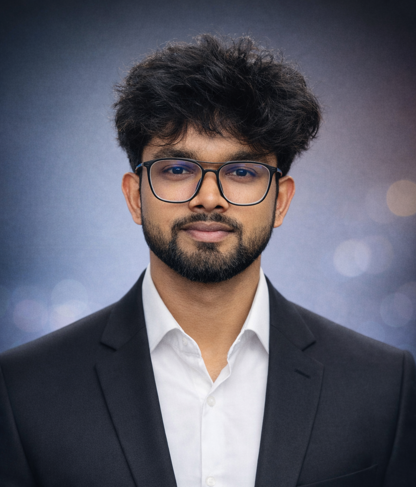

<div align="center">


<br/>



<br/><br/>

# Sameer Ahmad

**AI Engineer · MCA in Data Science & AI**

*Building intelligent systems with Python, ML & Deep Learning*

<br/>

[](https://linkedin.com/in/afrozsameerahmad)&nbsp;
[](mailto:sameerahmad723898@gmail.com)&nbsp;
[](https://sameer-portfolio-eight-orcin.vercel.app/)&nbsp;
[](https://github.com/afrozsameerahmad)

</div>

---

## About Me

I'm an **AI Engineer** pursuing my MCA in Data Science & Artificial Intelligence at BBD University, Lucknow. With 3 completed internships and hands-on ML projects, I build data-driven AI solutions — from data pipelines to deployed models.

- 🎓 **MCA (Data Science & AI)** — BBD University, Lucknow *(July 2025 – Present)*
- 💼 Worked at **Minematics · Flora Edze · Cognifyz Technologies**
- 🤖 Building towards **AI Engineering, MLOps & Production AI Systems**
- 🔍 Strong in **EDA, Time Series Forecasting, Feature Engineering & Model Evaluation**
- 📍 Lucknow, Uttar Pradesh, India

---

## Experience

| Company | Role | Work |
|---|---|---|
| **Minematics** | Data Science Intern | Data preprocessing, EDA, ML model development with Scikit-learn, visualization with Matplotlib & Seaborn |
| **Flora Edze** | Data Science Intern *(Project-Based)* | End-to-end e-commerce sales forecasting, historical trend analysis, business reporting |
| **Cognifyz Technologies** | Data Science Intern *(Remote)* | Restaurant dataset cleaning, feature engineering, correlation analysis, EDA with Pandas & Matplotlib |

---

## Tech Stack

**Core**
`Python` `SQL` `Pandas` `NumPy`

**Machine Learning & Forecasting**
`Scikit-learn` `XGBoost` `ARIMA` `Facebook Prophet` `Time Series` `Regression`

**Deep Learning**
`TensorFlow` `Neural Networks` `LSTM`

**Visualization**
`Matplotlib` `Seaborn` `Microsoft Excel`

**Tools & Platforms**
`Jupyter Notebook` `VS Code` `Git` `GitHub` `FastAPI`

**Databases**
`MySQL` `MS SQL Server`

**Techniques**
`EDA` `Data Cleaning` `Feature Engineering` `Model Evaluation (MAE · RMSE · MAPE)` `Data Pipelines` `Model Deployment`

---

## Projects

### [📊 Sales Forecasting System](https://github.com/afrozsameerahmad/FloraEdze-sales-forecasting-project)
End-to-end sales prediction pipeline comparing **ARIMA, Random Forest, XGBoost and LSTM** on historical e-commerce data. Includes full preprocessing, feature engineering, and evaluation using RMSE and MAE metrics. Built during the Flora Edze internship.

`Python` · `XGBoost` · `ARIMA` · `LSTM` · `Scikit-learn` · `Pandas`

---

### [🏃 Fitabase Fitness & Sleep Analysis](https://github.com/afrozsameerahmad/Fitabase-Fitness-Sleep-Analysis)
Deep EDA on Fitbit activity and sleep data — steps, calories burned, active minutes, distance, and sleep quality patterns. Surfaces actionable health insights through data visualisation.

`Python` · `Pandas` · `Matplotlib` · `Seaborn`

---

### [🍽️ Restaurant Data Analysis](https://github.com/afrozsameerahmad/Cognifyz_Internship_tasks)
Restaurant dataset analysed end-to-end for the Cognifyz Technologies internship. Handled missing values, engineered features, ran correlation studies, and delivered clear visual insights.

`Python` · `Pandas` · `NumPy` · `Matplotlib` · `Excel`

---
`Open Learning` · `Daily Commits` · `ML to AI Engineering`

---

## Currently Building

```text
AI Engineering     →  LLMs, Prompt Engineering, AI APIs
Deep Learning      →  TensorFlow, CNNs, LSTMs
MLOps              →  FastAPI, Model Serving, Pipelines
AI System Design   →  Scalable Architectures
```

---

<div align="center">

*Open to AI engineering internships, collaborations, and project opportunities.*

<br/>

[](https://linkedin.com/in/afrozsameerahmad)&nbsp;
[](mailto:sameerahmad723898@gmail.com)&nbsp;
[](https://sameer-portfolio-eight-orcin.vercel.app/)

<br/><br/>


</div>
